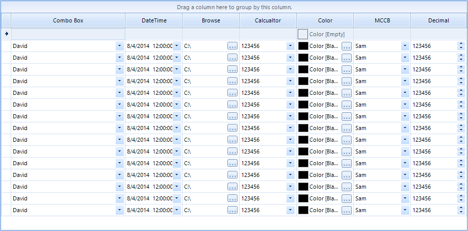

## Environment
<table>
	<tr>
		<td>Product Version</td>
		<td>2019.3 917</td>
	</tr>
	<tr>
		<td>Product</td>
		<td>RadGridView for WinForms</td>
	</tr>
</table>

## Description 
This example allows you to indicate the column type when the grid is first shown. For example, if you have GridViewComboBoxColumn you will want the user to know that he or she can choose from a list of predefined items.

